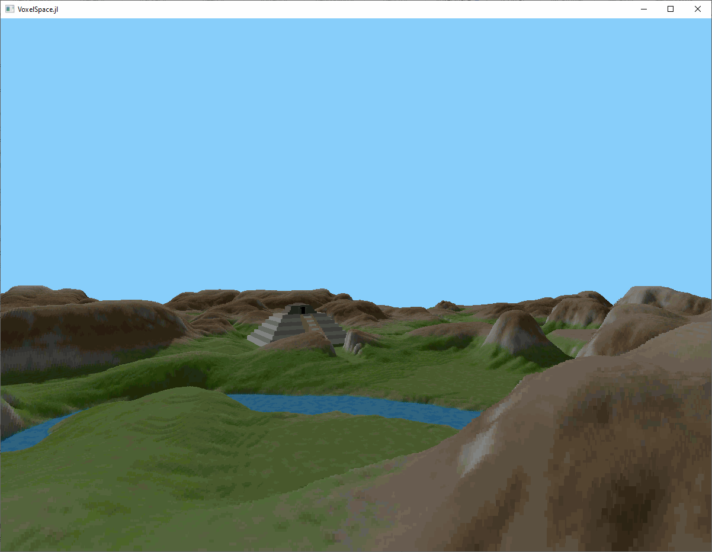

# VoxelSpace.jl

A simple 2.5D rendering engine in Julia. The code in the repository was strongly inspired by the tutorial at [s-macke/VoxelSpace](https://github.com/s-macke/VoxelSpace), though I did not look at the JavaScript code.

## Usage
To install, run
```
]add https://github.com/jebej/VoxelSpace
```
Then, to start the game, choose a map, e.g. `"C1W"`, and run:
```julia
using VoxelSpace
VoxelSpace.run("C1W")
```

You can move around with the `WASD` keys, go up and down with `SPACE` and `CTRL-L`, look left and right with the mouse, and speed up with `LSHIFT`.




## License
Just like for the repository at [s-macke/VoxelSpace](https://github.com/s-macke/VoxelSpace), the Julia code here is released under the MIT license. I also reproduce the disclaimer from that repository here:
> Please keep in mind, that the Voxel Space technology might be still patented in some countries. The color and height maps are reverse engineered from the game Comanche and are therefore excluded from the license.
